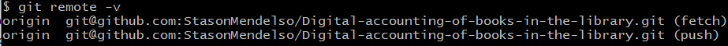

# Digital accounting of books in the library

## What is the project about?

Repository is for implementing the technical task from the course -
creating a web-application for digital accounting of books in the
library and accounting information about library's readers. You can
find more information about task [here](Project%20Technical%20Task.pdf).

## What is the purpose of this project?

The **purpose** of the project is ***using knowledge*** in practice, learned
about the Spring framework on the [course](https://www.udemy.com/course/spring-alishev/),
how it should be used to implement the task. As for me, I haven't got
almost any experience of using [Spring][2] in such tasks, so I want to try it
instead of using the [Servlet API][3] in web-applications.

In addition to, it is the first project, where I use the Spring framework for implementing
such technical task.

## Getting Started

For running the app you need to download the latest version from the main branch and configure
the database and connection to it. Follow the next chapters.

### Prerequisites

For running some branches of the projects you need the next:

* [Tomcat 9.0.60](https://tomcat.apache.org/) - for running the Spring MVC application part.
* [PostgreSQL 15](https://www.postgresql.org/) - for running the app with database. Also you can use another database.
  You can find the [script](database/dump.sql) of creating database in directory with name "*[database](database)*".

### Installation Instruction

#### How to download project on my local machine?

For downloading the project locally you can use two variants:

1. Download the ZIP archive from the repository page.

   The method is easy, the next steps helps you:
    1. Find the button `Code` and press it.
    2. Find the button `Download ZIP` and press it. The downloading must start.
    3. Unzip the archive in soe directory and run the IDEA in this directory.

   Project has been installed. After opening it in your IDEA, the `Maven` downloads
   some additional dependencies.
2. Use the `Git` for downloading the repository locally.

   The method a lit bit difficult, but the project will be downloaded with the help
   of several commands, and not manually, as in the previous method. For this method
   you **need** to [install][4] the `Git Bash` on your computer, make some configuration and have a primary skill of
   using this system of version control.
    1. Enter your [name][5], [email][6] of GitHub account locally on your machine.
    2. Create an empty directory and initialize it as git repository. Use the next
       command - `git init`.
    3. Adds this repository to yours with name `origin` (you can change it, if you want):
        ```
       $ git remote add origin git@github.com:StasonMendelso/Digital-accounting-of-books-in-the-library.git
       ```
       But you need configure your SSH connection to your GitHub profile in Git Bash. See more [here][7].
            
       For viewing that the repository has been added successfully to your local
       repository, you need execute the next command and get the following result:
       ```
       $ git remote -v
       ```
       

       After this step your local repository has got a 'connection' to the remote
       project from the GitHub repository.
    4. For downloading the project use the following command:
       ```
       $ git pull origin
       ```
       After these steps your project directory must contain the project files from
       GitHub repository. In addition to, you can create a new branch, make some
       changes and create a pull request for suggesting your improvements. Also, all
       changes are observed by the `git` and you can always make a rollback of
       all changes `git reset --hard`.

#### What things you need to install the software and how to install them?

##### Database configuration

For running the database you can use as me PostgreSQL or create your own database on another SQL server
using the [script](database/dump.sql) file of creating the database. **Note**: if you use another server not such
PostgreSQL you should change JDBC driver for working with it and configurate the connection to your
server in appropriate property file, which you must create manually.
<br>
You can find an empty [database configuration file](src/main/resources/database.properties.origin),
which must be renamed to "*database.properties*" instead of "*database.properties.origin*". This file
contains only keys for configuration the database, so you can put your values to the file and run
application with this database configuration.

##### Server configuration

For running the code you need install the Tomcat and configure it
in your idea. If you use the Intellij IDEA you can click on **Run** button and choose **Edit configuration**,
then add configuration for Tomcat server. Almost all configuration of app must be added
automatically, but check it before running. You can see
official [guide](https://www.youtube.com/watch?v=ThBw3WBTw9Q&ab_channel=IntelliJIDEAbyJetBrains).
After configuration, you can press run button of the server and go to browser to check the application work.

## Built With

* [Maven](https://maven.apache.org/) - Dependency Management

## Author

* **Stanislav Hlova** - *All work* - [StasonMendelso](https://github.com/StasonMendelso)

[1]:https://www.udemy.com/course/spring-alishev/
[2]:https://spring.io/
[3]:https://tomcat.apache.org/tomcat-5.5-doc/servletapi/index.html
[4]:https://git-scm.com/downloads
[5]:https://docs.github.com/en/get-started/getting-started-with-git/setting-your-username-in-git
[6]:https://docs.github.com/en/account-and-profile/setting-up-and-managing-your-personal-account-on-github/managing-email-preferences/setting-your-commit-email-address
[7]:https://docs.github.com/en/authentication/connecting-to-github-with-ssh